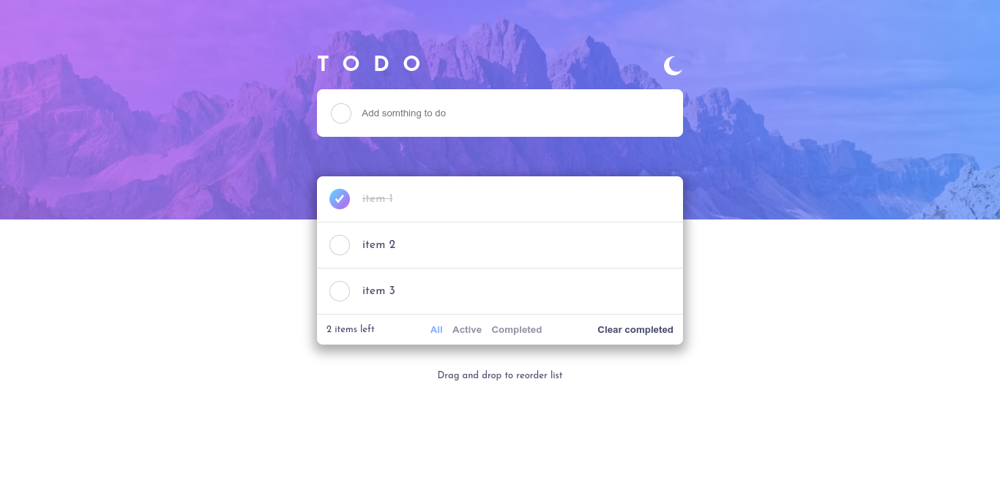
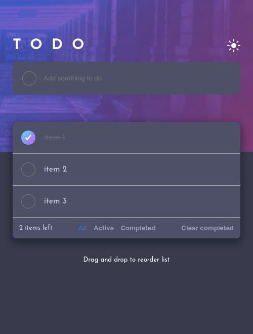

# Frontend Mentor - Todo app solution

This is a solution to the [Todo app challenge on Frontend Mentor](https://www.frontendmentor.io/challenges/todo-app-Su1_KokOW). Frontend Mentor challenges help you improve your coding skills by building realistic projects. 

## Table of contents

- [Overview](#overview)
  - [The challenge](#the-challenge)
  - [Screenshot](#screenshot)
  - [Links](#links)
- [My process](#my-process)
  - [Built with](#built-with)
  - [What I learned](#what-i-learned)
  - [Continued development](#continued-development)
- [Author](#author)

## Overview

### The challenge

Users should be able to:

- View the optimal layout for the app depending on their device's screen size
- See hover states for all interactive elements on the page
- Add new todos to the list
- Mark todos as complete
- Delete todos from the list
- Filter by all/active/complete todos
- Clear all completed todos
- Toggle light and dark mode
- **Bonus**: Drag and drop to reorder items on the list

### Screenshot





### Links

- Solution URL: [github.com/blaqbox-prime/todo-app-redux](https://github.com/blaqbox-prime/todo-app-redux)
- Live Site URL: [fem-todo-redux.web.app](https://fem-todo-redux.web.app)

## My process

### Built with

- Semantic HTML5 markup
- Flexbox
- Desktop-first workflow
- [React](https://reactjs.org/) - JS library
- [redux](https://redux.js.org/) - a predictable state container for JavaScript apps
- [Redux Toolkit](https://redux-toolkit.js.org/) - utilities to simplify common use cases like store setup, creating reducers, immutable update logic, and more
- [ChakraUI](https://chakra-ui.com/) - Used their hooks for MediaQueries

### What I learned

I intended to use this project to explore using redux as a state manager and even though it takes quite a bit of setup and boilerplate, it just makes it all worth it. It's simple, it's convenient and easy to manage. Gives your app a good looking structure and organization. 

- example of the Todos state
```js
import { createSlice } from "@reduxjs/toolkit";

export const todosSlice = createSlice({
    name: "todos",
    initialState: [{id:123, content: 'item 1', completed: true},{id:456, content: 'item 2', completed: false},{id:789, content: 'item 3', completed: false}],
    reducers: {
        create : (state, action) => {
            state.push(action.payload);
        },
        remove : (state, action) => {
            return state.filter(todo => todo.id !== action.payload); 
        },
        updateStatus : (state, action) => {
          let idx = state.findIndex(todo => todo.id === action.payload.id);
          if(action.payload.completed === true){
            state[idx].completed = false
            }else{
                state[idx].completed = true;
          }
        },
        clearCompleted: (state, action) => {
            return state.filter(todo => todo.completed === false)
        },

        reorder: (state, action) => {
            const copyListItems = [...state];
            const dragItemContent = copyListItems[action.payload.dragItem];
            copyListItems.splice(action.payload.dragItem, 1);
            copyListItems.splice(action.payload.dragOverItem, 0, dragItemContent);
            return copyListItems;
        }
    }
})


export const {create, updateStatus, clearCompleted, remove, reorder} = todosSlice.actions;
export default todosSlice.reducer;
```

#### drag & drop
Another **big** learning step here was the drag and drop API. Never heard of it until I started working on this project and was a good lesson to learn. Along with the reordering of list items using the drag and drop API. An interesting thing to have come across. 

[This helped a lot here](https://www.rootstack.com/en/blog/how-do-i-use-drag-and-drop-react/). Although I refactored the code and moved the mutating code into the redux slice

```js
reorder: (state, action) => {
            const copyListItems = [...state];
            const dragItemContent = copyListItems[action.payload.dragItem];
            copyListItems.splice(action.payload.dragItem, 1);
            copyListItems.splice(action.payload.dragOverItem, 0, dragItemContent);
            return copyListItems;
        }
```

#### Theme
I tried to create a theme without the use of 3rd party libraries. Normaly I would just load up [Chakra-UI](https://chakra-ui.com) and adjust the predefined theme switcher that comes working out-of-the-box but I wanted to try my hand at it. Can't say it was good but it got the job done for sure. Hopefully I'd have a better go of it next time.

```js
const dark = {
Very_Dark_Blue: "hsl(235, 21%, 11%)",
Very_Dark_Desaturated_Blue: "hsl(235, 24%, 19%)",
Light_Grayish_Blue: "hsl(234, 39%, 85%)",
Light_Grayish_Blue_hover: "hsl(236, 33%, 92%)",
Dark_Grayish_Blue: "hsl(234, 11%, 52%)",
Very_Dark_Grayish_Blue: "hsl(233, 14%, 35%)",
Bg_Grayish_Blue: "hsl(237, 14%, 26%)"
}

export function setTheme(theme){
    if(theme === 'light'){
        document.body.style.backgroundColor = '#FFFFFF';
        document.body.style.color = 'hsl(235, 19%, 35%)';
        
        // containers

        let allContainers = document.querySelectorAll('.themed-container');
          allContainers.forEach(function(container) {
          container.style.backgroundColor = '#FFFFFF';
          container.style.color = 'hsl(235, 19%, 35%)';
        })

        // buttons

        let allButtons = document.querySelectorAll('button');
          allButtons.forEach(function(button) {
          button.style.color = 'hsl(235, 19%, 35%)';
        })
  
      } else {
        document.body.style.backgroundColor = dark.Bg_Grayish_Blue;
        document.body.style.color = '#ffffff';
  
        let allContainers = document.querySelectorAll('.themed-container');
          allContainers.forEach(function(container) {
          container.style.backgroundColor = dark.Very_Dark_Grayish_Blue;
          container.style.color = dark.Light_Grayish_Blue;
        })

        // buttons

        let allButtons = document.querySelectorAll('button');
          allButtons.forEach(function(button) {
          button.style.color = dark.Light_Grayish_Blue;
        })
      }
}
```


### Continued development

I wanted to cover some react testing in this project as well but I haven't squeezed that in yet. I might do a completely different thing for it or I will create a copy of this project and try building the tests with it and exploring it that way.

## Author

- Instagram - [@ig_blaqbox.dev](https://www.instagram.com/ig_blaqbox.dev)
- Frontend Mentor - [@blaqbox-prime](https://www.frontendmentor.io/profile/blaqbox-prime)
- github - [@blaqbox-prime](https://www.github.com/blaqbox-prime)
- LinkedIn - [Karabo Sambo](https://www.linkedin.com/in/karabo-sambo-b768621b7/)
